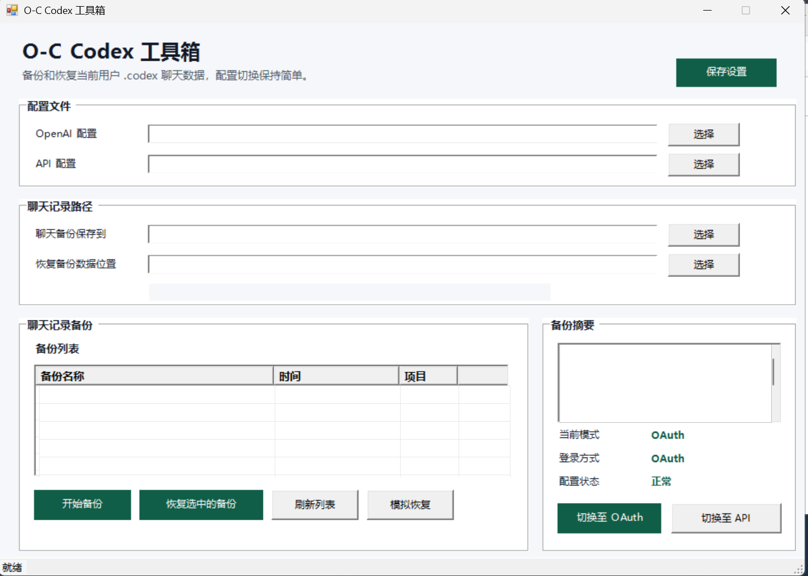

# O-C Codex 工具箱

O-C 是一个 Windows 原生桌面工具，用来管理 Codex Desktop 的本机配置切换和聊天记录备份恢复。

它目前主要解决两件事：

- 在 **OpenAI / ChatGPT OAuth** 和 **API 配置** 之间切换 Codex 本机配置。
- 备份、恢复当前 Windows 用户的 `%USERPROFILE%\.codex` 聊天记录数据，方便重装系统或迁移电脑后继续看到原来的对话。

> O-C 只处理本机文件，不提供 OpenAI 账号、API Key、CPAMC/NewAPI 服务或第三方额度。

项目参考：[Dailin521/codex-provider-sync](https://github.com/Dailin521/codex-provider-sync)

## 当前进度

| 模块 | 状态 | 说明 |
| --- | --- | --- |
| Windows 图形界面 | 已完成 | PowerShell WinForms 原生窗口，浅灰背景、中文按钮、路径选择、备份列表、摘要栏、底部状态栏。 |
| OpenAI/API 配置切换 | 已完成 | 选择两份 `config.toml` 后，可一键切换至 OAuth 或 API。 |
| 聊天记录备份 | 已完成 | 默认读取当前用户 `%USERPROFILE%\.codex`，备份保存位置可自选。 |
| 聊天记录恢复 | 已完成 | 恢复备份数据位置可自选，默认恢复到当前用户 `%USERPROFILE%\.codex`。 |
| 配置与登录保护 | 已完成 | 聊天备份/恢复不会覆盖 `config.toml` 和 `auth.json`。 |
| provider 同步与修复 | 已完成 | 切换和恢复后会同步 rollout、SQLite、`session_index.jsonl` 等本地索引。 |
| 成功/失败提示 | 已完成 | 关键操作完成后直接弹出中文提示框，失败时弹出错误提示。 |
| 日志与排查 | 已完成 | 启动器和主脚本写入 `%APPDATA%\C-O\logs`。 |
| 调试/备用入口 | 已完成 | 提供 `Debug-O-C.bat` 和 `O-C-Menu.bat`。 |
| Release 打包 | 已完成 | 可生成 `dist\O-C` 和 `dist\O-C-v0.1.0-win-x64.zip`。 |

## 适用场景

### 模式切换

很多用户会同时使用：

- 官方 ChatGPT/OpenAI OAuth 登录。
- API 方式接入第三方兼容服务，例如 CPAMC、NewAPI 或其他 OpenAI 兼容接口。

切换后聊天记录有时并没有丢失，只是 Codex 本地记录里的 provider 元数据和当前配置不一致，导致侧边栏看不到旧对话。O-C 会在切换时备份当前状态、写入目标配置，并同步本地聊天记录索引。

### 重装系统前备份聊天记录

如果你准备重装系统，可以：

1. 在旧系统打开 O-C。
2. 把 `聊天备份保存到` 选到 U 盘或移动硬盘。
3. 点击 `开始备份`。
4. 自己另外备份项目文件夹，例如桌面的 `Codex` 项目目录。
5. 重装系统后打开 O-C。
6. 在 `恢复备份数据位置` 选择刚才备份出来的聊天记录目录。
7. 点击 `恢复选中的备份`。

O-C 负责的是 Codex 的本机聊天数据，不负责备份你的项目文件夹。

## 图形界面

主界面是一个普通 Windows 工具窗口，不是浏览器页面。

界面包含：

- 大标题和说明文字。
- `OpenAI 配置` 路径选择。
- `API 配置` 路径选择。
- `聊天备份保存到` 路径选择。
- `恢复备份数据位置` 路径选择。
- 左侧备份列表。
- 右侧备份摘要和当前模式状态。
- 底部状态栏。

主要按钮：

- `开始备份`
- `恢复选中的备份`
- `刷新列表`
- `模拟恢复`
- `切换至 OAuth`
- `切换至 API`
- `保存设置`

操作成功或失败时会弹出中文提示框。长时间操作时按钮会临时禁用，底部状态栏会显示当前进度。

## 界面预览



## 使用前准备

你需要准备两份 Codex 配置文件。

### 1. OpenAI 配置

1. 打开 Codex Desktop。
2. 使用官方 ChatGPT/OpenAI 账号登录。
3. 确认可以正常聊天。
4. 找到当前配置：

```text
%USERPROFILE%\.codex\config.toml
```

5. 复制一份保存为你的 OpenAI 配置，例如：

```text
D:\codex-configs\openai-config.toml
```

### 2. API 配置

1. 按你的 API 服务教程配置 Codex。
2. 确认 Codex 可以通过 API 正常聊天。
3. 再复制当前配置：

```text
%USERPROFILE%\.codex\config.toml
```

4. 保存为你的 API 配置，例如：

```text
D:\codex-configs\api-config.toml
```

这份配置可以是 CPAMC、NewAPI 或其他 OpenAI 兼容接口配置。配置文件可能包含 API Key，请自行妥善保管。

## 第一次使用

1. 下载 Release 压缩包并解压。
2. 双击 `O-C.exe` 启动。
3. 在 `OpenAI 配置` 选择官方 OAuth 的 `config.toml`。
4. 在 `API 配置` 选择 API 模式的 `config.toml`。
5. 在 `聊天备份保存到` 选择备份保存目录，推荐 U 盘或移动硬盘。
6. 如果要恢复旧备份，在 `恢复备份数据位置` 选择某个包含 `manifest.json` 的 O-C 聊天备份目录。
7. 点击 `保存设置`。

设置会保存到：

```text
%APPDATA%\C-O\settings.json
```

日志会写入：

```text
%APPDATA%\C-O\logs
```

## 模式切换

建议切换前先关闭 Codex Desktop，避免 `.codex` 里的数据库或会话文件被占用。

### 切换至 API

1. 打开 O-C。
2. 点击 `切换至 API`。
3. O-C 会备份当前状态。
4. 写入 API 配置。
5. 处理 OAuth/API 登录缓存差异。
6. 同步聊天记录 provider、SQLite 线程表和 `session_index.jsonl`。
7. 完成后弹出成功提示。
8. 重新打开 Codex Desktop。

### 切换至 OAuth

1. 打开 O-C。
2. 点击 `切换至 OAuth`。
3. O-C 会备份当前状态。
4. 写入 OpenAI 配置。
5. 移走 API 模式下不兼容的 auth 文件。
6. 同步聊天记录 provider、SQLite 线程表和 `session_index.jsonl`。
7. 完成后弹出成功提示。
8. 重新打开 Codex Desktop。如果 Codex 要求登录，使用官方账号重新登录即可。

## 聊天记录备份和恢复

### 备份会包含

O-C 的聊天记录备份会复制当前用户 `.codex` 中和聊天显示相关的数据，例如：

```text
sessions
archived_sessions
attachments
memories
sqlite
session_index.jsonl
.codex-global-state.json
state_5.sqlite
logs_2.sqlite
goals_1.sqlite
memories_1.sqlite
对应的 -wal / -shm 文件
```

每个备份目录都会生成：

```text
manifest.json
```

恢复时会用它判断该目录是不是有效的 O-C 聊天记录备份。

### 备份不会包含

聊天记录备份不会复制：

```text
config.toml
auth.json
```

这样做是为了避免恢复聊天记录时覆盖新系统上的登录状态和当前配置。

### 恢复会做什么

恢复时，O-C 会：

1. 检查备份目录是否包含有效 `manifest.json`。
2. 默认恢复到当前用户 `%USERPROFILE%\.codex`。
3. 恢复前先创建一份 `before-chat-restore` 安全备份。
4. 替换聊天记录相关文件。
5. 自动修复嵌套 `sessions\sessions`、SQLite 线程索引、provider 和 `session_index.jsonl`，尽量让恢复后的聊天记录直接出现在 Codex Desktop 里。

## 目录说明

默认备份根目录：

```text
D:\codex-back
```

常见子目录：

```text
D:\codex-back\codex-switch
D:\codex-back\history-sync
D:\codex-back\chat-history
D:\codex-back\c-o-safety-backups
```

### `codex-switch`

保存模式切换相关的配置和账号缓存备份，例如 OpenAI/API 两种模式的状态。

### `history-sync`

保存 provider 同步前的聊天记录元数据备份。

### `chat-history`

默认聊天记录备份目录。如果你在界面里选择了 U 盘路径，就会保存到你选择的位置。

### `c-o-safety-backups`

保存升级、迁移或清理时产生的安全备份。

## 启动入口

Release 包里主要有这些入口：

```text
O-C.exe
Debug-O-C.bat
O-C-Menu.bat
Create-O-C-Shortcut.bat
```

### `O-C.exe`

正常图形界面启动器。它会隐藏命令行窗口并启动 WinForms 主界面。

### `Debug-O-C.bat`

调试启动脚本。适合图形界面闪退或打不开时使用，会保留黑窗口并写日志。

### `O-C-Menu.bat`

备用菜单入口。图形界面打不开时，可以用它执行关键功能，例如聊天备份、聊天恢复、切换至 OAuth、切换至 API、打开日志目录。

### `Create-O-C-Shortcut.bat`

创建桌面快捷方式。

## 项目结构

```text
O-C/
  O-C.exe                         # Release 启动器，打包后生成
  README.md
  LICENSE
  Build-O-C-Release.bat
  Create-O-C-Shortcut.bat
  Debug-O-C.bat
  O-C-Menu.bat
  Push-GitHub.bat
  picture/
    oc-toolbox-current.png
    1.png
    2.png
  Source_Codes/
    build/
      Build-O-C-Release.ps1
    launcher/
      Program.cs
      O-C.Launcher.csproj
    tools/
      CodexUnifiedSwitcher.ps1
    tests/
      Test-CodexUnifiedSwitcher.ps1
      Test-CodexUnifiedSwitcher-ChatHistoryBackup.ps1
      Test-CodexUnifiedSwitcher-CockpitAuth.ps1
      Test-CodexUnifiedSwitcher-CPAMCWithoutAuth.ps1
      Test-CodexUnifiedSwitcher-OAuthWorkspaceRestore.ps1
      Test-CodexUnifiedSwitcher-Preflight.ps1
      Test-CodexUnifiedSwitcher-RolloutBackfill.ps1
      Test-CodexUnifiedSwitcher-SyncFailureDoesNotAbort.ps1
      Test-CodexUnifiedSwitcher-Ui.ps1
      Test-OCPackaging.ps1
      Test-PushScript.ps1
```

核心脚本：

```text
Source_Codes\tools\CodexUnifiedSwitcher.ps1
```

## 开发与测试

运行全部测试：

```powershell
$tests = Get-ChildItem -LiteralPath .\Source_Codes\tests -Filter 'Test-*.ps1' | Sort-Object Name
foreach ($test in $tests) {
  powershell -NoProfile -ExecutionPolicy Bypass -File $test.FullName
  if ($LASTEXITCODE -ne 0) { throw "FAILED $($test.Name)" }
}
```

单独运行 UI 检查：

```powershell
powershell -NoProfile -ExecutionPolicy Bypass -File .\Source_Codes\tests\Test-CodexUnifiedSwitcher-Ui.ps1
```

单独运行聊天备份/恢复检查：

```powershell
powershell -NoProfile -ExecutionPolicy Bypass -File .\Source_Codes\tests\Test-CodexUnifiedSwitcher-ChatHistoryBackup.ps1
```

生成 Release：

```powershell
.\Build-O-C-Release.bat
```

产物会输出到：

```text
dist\O-C
dist\O-C-v0.1.0-win-x64.zip
```

推送到 GitHub：

```powershell
.\Push-GitHub.bat
```

## 常见问题

### O-C 会备份我的项目文件夹吗？

不会。O-C 只备份 Codex 的本机聊天数据。项目文件夹需要你自己备份。

### 聊天记录在 `.codex` 里还是项目文件夹里？

Codex 的本机聊天记录主要在当前用户的 `%USERPROFILE%\.codex` 里。项目文件夹是你的代码和资料，两者需要分开备份。

### 恢复聊天记录会覆盖我的 API Key 或登录状态吗？

不会。聊天记录备份/恢复不会复制或覆盖 `config.toml` 和 `auth.json`。

### 为什么建议关闭 Codex 后再备份或切换？

Codex 运行时可能正在占用 SQLite、WAL、SHM 或会话文件。关闭 Codex 后操作更稳定。

### O-C 可以恢复已经删除的聊天内容吗？

不可以。O-C 只能恢复你之前用 O-C 备份过的聊天记录数据。

### 操作失败怎么排查？

先打开日志目录：

```text
%APPDATA%\C-O\logs
```

如果图形界面打不开，用 `Debug-O-C.bat` 启动，它会保留窗口并写入调试日志。

## License

以仓库中的 `LICENSE` 文件为准。

---

## ⭐ Star History

<a href="https://star-history.com/#angusdevgo/OC-Codex&Date">
 <picture>
   <source media="(prefers-color-scheme: dark)" srcset="https://api.star-history.com/svg?repos=angusdevgo/OC-Codex&type=Date&theme=dark" />
   <source media="(prefers-color-scheme: light)" srcset="https://api.star-history.com/svg?repos=angusdevgo/OC-Codex&type=Date" />
   
 </picture>
</a>
